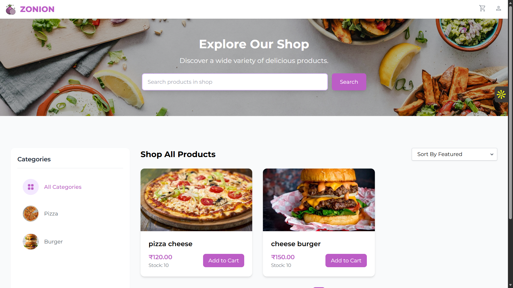

# 🍽️ Zonion — Food Ordering Platform

## 🚀 Overview

**Zonion** is a full-stack food ordering web application built for a single restaurant.
It allows users to browse food items, add them to a cart, and place orders, while admins can manage products and categories.

This project focuses on **server-side rendering (SSR)** using Spring Boot and provides a smooth and secure ordering experience.

---

## ✨ Features

### 👤 User Features

* Browse food menu with categories
* Add/remove items from cart
* Place orders
* Form validation for secure checkout

### 🔐 Admin Features

* Admin login system
* Add / update / delete products
* Manage categories
* View and manage orders

---

## 🛠️ Tech Stack

### Backend

* Java + Spring Boot
* Spring MVC (SSR with Thymeleaf)
* Spring Security (basic auth / role-based)

### Frontend

* Thymeleaf (Server-Side Rendering)
* HTML, CSS

### Database

* MongoDB *(or PostgreSQL if you used it)*

### DevOps / Deployment

* AWS EC2
* Nginx (Reverse Proxy)
* HTTPS enabled

---

## ⚙️ Setup & Installation

### 1️⃣ Clone the repository

```powershell
git clone https://github.com/your-username/zonion.git
cd zonion
```

### 2️⃣ Configure `application.properties`

```properties
spring.data.mongodb.uri=mongodb://localhost:27017/zonion
server.port=8080
```

---

### 3️⃣ Run the Backend

```powershell
mvn clean install
mvn spring-boot:run
```

---

### 4️⃣ Open in Browser

```
http://localhost:8080
```

---

## 📸 Screenshots

### 🏠 Home Page


```

```

---

## 🔐 Roles

| Role  | Access                       |
| ----- | ---------------------------- |
| User  | Browse, Cart, Order          |
| Admin | Manage Products & Categories |

---

## 📂 Project Structure

```
src/
 ├── controller/
 ├── service/
 ├── repository/
 ├── model/
 └── templates/   (Thymeleaf views)
```

---

## 🌐 Live Demo

*(Add your deployed link if available)*

---

## 📌 Future Improvements

* Payment gateway integration
* Order tracking system
* REST API version for mobile apps
* React frontend version

---

## 👨‍💻 Author

**Muhammed Elham**

* GitHub: https://github.com/your-username
* LinkedIn: https://www.linkedin.com/in/muhammed-elham-6b73431b9

---

## ⭐ Support

If you like this project, give it a ⭐ on GitHub!
